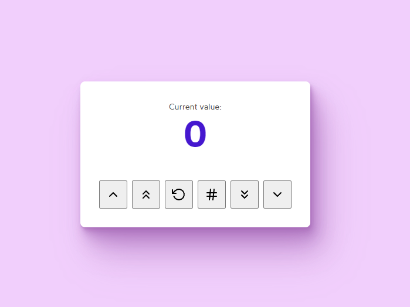

# React Counter App

## Overview
Simple ReactJs counter app made with Vite. This project was built to practice state management and events. Also featuring acessibility features like visually hidden text.

## Features
- **Increment/Decrement**: Users can increase or decrease the count by 1 or 10.
- **Reset**: Resets the count back to zero.
- **Random**: Sets the count to a random value between 1 and 100.
- **Accessible Design**: Visually hidden texts for screen readers, ensuring the app is accessible.

## UI Snapshot

## Code Structure
- The `App` component manages the application's state and renders the UI.
- State management is done using React's `useState` hook to keep track of the count.
- Event handlers are set up to respond to button clicks for different actions.
- React Feather Icons are used for visual representation of the actions.

## Getting Started
To run this project locally:

1. Clone the repository to your local machine.
2. Navigate to the project directory.
3. Install the dependencies with `npm install`.
4. Start the development server with `npm run dev`.
